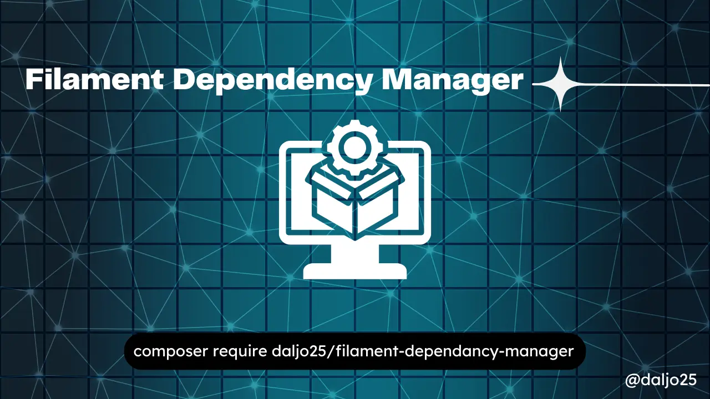
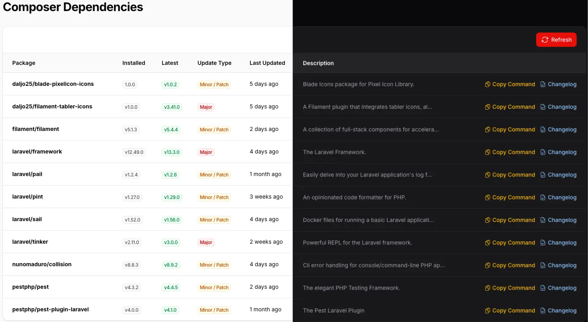
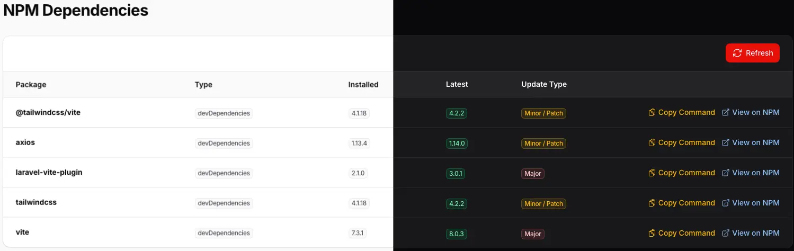

# Filament Dependency Manager



[](https://packagist.org/packages/daljo25/filament-dependency-manager)
[](https://packagist.org/packages/daljo25/filament-dependency-manager)

A Filament plugin to monitor outdated **Composer** and **NPM** dependencies directly from your admin panel.

---

## Table of Contents

- [Features](#features)
- [Screenshots](#screenshots)
- [Requirements](#requirements)
- [Installation](#installation)
- [Configuration](#configuration)
- [Environment Variables](#environment-variables)
- [Usage](#usage)
- [Translations](#translations)
- [Testing](#testing)
- [Changelog](#changelog)
- [License](#license)

---

## Features

- 📦 View outdated Composer packages with current and latest versions
- 🟢 View outdated NPM packages with current and latest versions
- 🔗 Direct links to GitHub releases and NPM package pages
- 📋 Copy update commands to clipboard
- 🌍 Multilingual support (English & Spanish included)
- ⚡ Results cached for 1 hour to avoid slow page loads

---

## Screenshots

### Composer Dependencies



### NPM Dependencies



---

## Requirements

- PHP 8.2+
- Laravel 11+
- Filament 5+
- `composer` accessible on the server
- `npm` or `pnpm`/`yarn` accessible on the server

---

## Installation

Install via Composer:

```bash
composer require daljo25/filament-dependency-manager
```

Run the install command:

```bash
php artisan dependency-manager:install
```

### Or publish manually

```bash
php artisan vendor:publish --tag="dependency-manager-config"
php artisan vendor:publish --tag="filament-dependency-manager-translations"
php artisan vendor:publish --tag="filament-dependency-manager-views"
```

---

## Configuration

Edit `config/dependency-manager.php`:

```php
return [
    'composer_binary' => env('DEPENDENCY_MANAGER_COMPOSER_BIN', null),
    'php_binary' => env('DEPENDENCY_MANAGER_PHP_BIN', null),

    'npm_client' => env('DEPENDENCY_MANAGER_NPM_CLIENT', 'npm'),
    'npm_binary' => env('DEPENDENCY_MANAGER_NPM_BINARY', null),

    'navigation' => [
        'group' => null,
    ],

    'composer' => [
        'title' => null,
        'navigation_label' => null,
        'icon' => null,
        'sort' => 1,
    ],

    'npm' => [
        'title' => null,
        'navigation_label' => null,
        'icon' => null,
        'sort' => 2,
    ],
];
```

---

## Environment Variables

| Variable | Default | Description |
|---|---|---|
| `DEPENDENCY_MANAGER_COMPOSER_BIN` | `null` | Path to composer binary |
| `DEPENDENCY_MANAGER_PHP_BIN` | `null` | Path to PHP binary |
| `DEPENDENCY_MANAGER_NPM_CLIENT` | `npm` | npm / pnpm / yarn |
| `DEPENDENCY_MANAGER_NPM_BINARY` | `null` | Path to npm binary |

Example:

```env
DEPENDENCY_MANAGER_COMPOSER_BIN=/Users/youruser/.config/herd-lite/bin/composer
DEPENDENCY_MANAGER_PHP_BIN=/Users/youruser/.config/herd-lite/bin/php
DEPENDENCY_MANAGER_NPM_BINARY=/usr/local/bin/npm
```

---

## Usage

Register the plugin:

```php
use Daljo25\FilamentDependencyManager\FilamentDependencyManagerPlugin;

public function panel(Panel $panel): Panel
{
    return $panel
        ->plugin(FilamentDependencyManagerPlugin::make());
}
```

You will see:

- **Composer**
- **NPM**

inside the **Dependency Manager** group.

---

## Translations

Supports:

- English
- Spanish

Publish translations:

```bash
php artisan vendor:publish --tag="filament-dependency-manager-translations"
```

---

## Testing

```bash
composer test
```

---

## Changelog

See [CHANGELOG](CHANGELOG.md)

---

## License

MIT License. See [LICENSE](LICENSE.md)